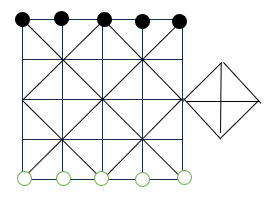

## 五马棋

五马棋是我家乡民间流传的一款游戏，其趣味性很足，而且通常就地取材，用家乡随处都有的文蛤贝壳做棋子，用红砖在水泥地上画棋盘即可玩耍

## 游戏规则

棋盘如图chessboard所示。主体部分是5*5的棋盘，双方各持5枚棋子（实地玩的时候以贝壳代替，可以翻面）。棋子初始位于棋盘的上侧和下侧，双方各5枚棋子，如图中所示。棋子可以在棋盘上延任意直线移动，但是不能跨越直线上已有的棋子。棋盘右侧有一个凸出的正方形部分，被称之为“茅厕”。

有两种方式可以吃掉对方的棋子，一种称之为“挑”，即对方恰好有两个棋子相互间隔，且你的棋子正好冲到中间，则将这两枚棋子翻转（即吃掉）。另一种称之为“夹”，即在你移动后，你两枚棋子正好把对方棋子夹在中间，则将其翻转。如果一次移动之后有多组“挑”或“夹”，则优先使得“挑”生效。如果是都是挑或者都是夹，则由玩家决定生效的先后顺序。

最终胜利的条件是，一方将另一方的所有棋子都吃掉，或者将另一方的棋子全部驱赶到“茅厕”中去。

## 实现要求

1. 一个NextJS实现的WebApp，纯前端计算。
2. 提供两种模式，人人对弈和人机对弈。人机对弈的时候，你需要提供智能。
3. 代码请写在src目录下。